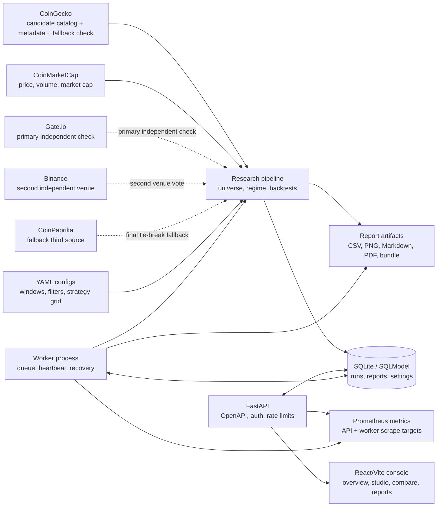

# Atlas20 Rotation

[](https://github.com/WW-shan/Atlas20/actions/workflows/ci.yml)
[](https://github.com/WW-shan/Atlas20/releases/latest)
[](LICENSE)
[](pyproject.toml)
[](apps/web/package.json)
[](src/atlas20/api/app.py)
[](apps/web)
[](docker-compose.yml)

Atlas20 Rotation is a production-minded crypto research console for testing
whether point-in-time top-20 non-stablecoin rotation can outperform BTC
buy-and-hold and top-20 equal weight benchmarks.

It is built like an operational research system, not a notebook dump: public
data ingestion, reproducible backtests, FastAPI services, a queued worker,
Prometheus metrics, OpenAPI contracts, Docker Compose deployment, GHCR images,
and a React/Vite console for reviewing results.

> Research only. Atlas20 does not provide financial advice and does not execute
> trades.

## Current Research Conclusion

The latest point-in-time, no-leverage study is recorded in `RESEARCH.md`.
The 21-day CTREND-breakout candidate still reports 25.87x at 2bps and 22.44x at
20bps from the exact 2022-01-01 start, but the September 2026 phase audit shows
that this result is not robust to the rebalance calendar. Shifting the same
21-day rule by 0-20 days gives a 20bps median of 3.94x and a worst phase of
0.61x. A fully staggered 21-tranche implementation returns 5.51x at 20bps with
a 1.11 Sharpe and -34.6% maximum drawdown, and is invariant to the start phase.
A second audit then isolated the BTC gate: the inherited 11-day/two-day rule is
a local parameter spike, not a broad plateau. Neighboring lookbacks of 10 and
14 days fall to 3.05x and 1.98x, and one-day confirmation falls to 2.20x. With
no gate at all the same phase-invariant basket returns 2.42x; own-stop-only
returns 2.37x. Those versions still beat BTC's 1.82x in this sample, but there
is currently no evidence for a stable 20x production strategy. A
volatility-scaled trailing gate was also tested as an evidence-based
replacement; its best phase-invariant result was only 3.22x with a -56%
maximum drawdown. A newer phase-invariant candidate now combines 14-day
balanced leader selection, a 75-day/three-day own-trend stop, a BTC 100-day
moving-average gate, and a 60-day volatility-target exposure capped at 1.0.
At 20bps, target volatilities of 50%-80% produce 3.91x-5.17x over the full
sample with Sharpe 1.00-1.07 and -33.9% to -45.7% maximum drawdown. In the
2025-2026 test segment they produce 1.64x-1.85x with Sharpe 1.08-1.12 and
-16.0% to -23.3% drawdown. The more conservative 50% target-vol version still
returns 2.23x at 100bps, and its worst rolling one-year window is 0.77x-0.82x;
it is more balanced than the old phase-sensitive strategy but is not risk-free.
This is the current leading research candidate, but it is still not a 20x
strategy and remains research-only. See
`docs/research/strategy_evidence_audit.md`,
`reports/strategy_evidence_audit_2022/`,
`reports/decision_point_ablation_2022/`,
`reports/volatility_gate_validation_2022/`, and
`reports/vol_target_neighborhood_2022/`.

## Why It Stands Out

- **Point-in-time universe construction**: top-20 candidates are rebuilt at each
  rebalance date with explicit stablecoin, wrapped asset, liquidity, and data
  quality filters.
- **Reproducible research pipeline**: raw public data, processed datasets,
  strategy summaries, charts, manifests, and markdown/PDF/bundle reports are
  generated from versioned YAML configs.
- **Console-grade backend**: FastAPI routes, SQLModel repositories, Alembic
  migrations, idempotent run submission, request IDs, rate limits, auth hooks,
  structured logs, and Sentry-safe redaction.
- **Real worker lifecycle**: backtests are queued, claimed, heartbeated,
  cancelled, recovered after stale ownership, and monitored through Prometheus.
- **Contract-aware frontend**: React/Vite, TanStack Query, generated OpenAPI
  types, Vitest, axe accessibility tests, and Playwright smoke coverage.
- **Ship-ready operations**: Docker Compose stack, GHCR images, backup/storage
  CLIs, health probes, load testing script, and release verification command.

## Architecture



## What Is Included

- Momentum, sector, and benchmark strategy backtests.
- Bull-regime and BTC trailing-stop risk overlays.
- Point-in-time top-20 universe construction from cached public data.
- FastAPI read/write API for the Atlas20 Research Console.
- Background worker for queued backtests and report generation.
- React/Vite web console for champion review, constrained reruns, compare,
  history, universe health, and reports.
- Prometheus metrics, structured logging, security gates, backup/storage
  commands, and Docker deployment files.
- Python, API, frontend, accessibility, OpenAPI, mypy, Ruff, and build checks.

## Quickstart

### Docker Compose

Use this when you want the full API, worker, and web stack with the same shape
as the published GHCR images.

```bash
docker compose up -d
docker compose exec backend python -m atlas20.api.seed
```

Then open:

- API health: `http://127.0.0.1:8000/healthz`
- API readiness: `http://127.0.0.1:8000/readyz`
- Worker metrics: `http://127.0.0.1:8001/metrics`
- Web console: `http://127.0.0.1:5173`

### Local Development

Python:

```bash
make setup
.venv/bin/python -m atlas20.api.seed
make dev
```

`make setup` creates `.venv` and installs the package in editable mode with
development dependencies. Keep Python dependencies inside `.venv`; do not
install Atlas20 development dependencies into the system interpreter.

Frontend:

```bash
npm --prefix apps/web ci
npm --prefix apps/web run dev
```

Worker:

```bash
PYTHONPATH=src .venv/bin/python -m atlas20.api.worker
```

In development, Vite proxies `/api` to `http://127.0.0.1:8000`.

### Research Pipeline

```bash
.venv/bin/python scripts/download_data.py --config config/base.yaml
.venv/bin/python scripts/build_datasets.py --config config/base.yaml
.venv/bin/python scripts/run_research.py --config config/base.yaml
```

Pass `--refresh-raw` to intentionally refresh public API data:

```bash
.venv/bin/python scripts/run_research.py --config config/base.yaml --refresh-raw
```

## Quality Gates

Run the release verification command before publishing:

```bash
.venv/bin/python scripts/verify_release.py
```

The CI matrix also runs these checks independently:

```bash
make test
make lint
make typecheck
.venv/bin/python -m atlas20.api.openapi --check
npm --prefix apps/web test
npm --prefix apps/web run typecheck
npm --prefix apps/web run build
npm --prefix apps/web run openapi:check
.venv/bin/python -m pip_audit --strict .
npm --prefix apps/web audit --audit-level=moderate --registry=https://registry.npmjs.org
```

`make test` runs the Python suite through pytest inside `.venv`; `make lint`
and `make typecheck` run Ruff and mypy through the same virtual environment.

Current local verification for this release line covers 568 Python tests plus
188 Vitest tests, frontend build, strict API mypy, generated OpenAPI types, and
Ruff, plus Python and frontend dependency audits.

## Operations Surface

| Area | Implementation |
| --- | --- |
| API | FastAPI app factory, OpenAPI snapshot, request IDs, access logs, rate limits |
| Persistence | SQLModel tables, Alembic migrations, repository layer |
| Worker | Queue claim, heartbeat, cancellation, stale-run recovery, subprocess isolation |
| Metrics | Prometheus counters, histograms, worker liveness gauge, `/metrics` scrape targets |
| Data freshness | Daily refresh heartbeat, `/api/data/freshness`, `/readyz` degradation, structured watchdog logs |
| Reports | Markdown, CSV, PNG, PDF fallback, zip bundle, manifest verification |
| Deployment | Dockerfile, `apps/web/Dockerfile`, Docker Compose, GHCR image references |
| Security | API key/JWT hooks, prod settings gates, report path validation, log redaction |

See `docs/operations/` for backup, storage, logging, worker, security, and load
testing notes.

## Repository Layout

```text
.
|-- apps/web/                 # React/Vite research console
|-- config/                   # Research windows and sector mappings
|-- data/                     # Local cached raw/processed public data
|-- docs/                     # Design and operations documentation
|-- reports/                  # Included research output snapshots
|-- scripts/                  # Research, API, verification, and load-test commands
|-- src/atlas20/              # Python package: pipeline, API, worker, backtests
|-- tests/                    # Python test suite
|-- pyproject.toml
`-- README.md
```

## Core Design

- Market cap is used for universe selection only.
- Portfolio construction is not market-cap weighted.
- Strategies allocate by momentum, sector strength, and risk-regime logic.
- The universe is rebuilt point in time at every rebalance date.
- Data assumptions are explicit and documented in generated reports.

## Data Stack

- CoinMarketCap: the **only** historical provider. Every daily price, dollar
  volume, market cap and circulating supply in the panel comes from one
  snapshot.
- CoinGecko: candidate catalog (current top-N plus a legacy watchlist), coin
  metadata, and the fallback second-source check for assets Gate.io does not
  list. It never supplies panel prices.
- Gate.io: preferred second source for every listed asset. It has a generous
  public candle API, covers the delisted CEL and HT pairs, and never rewrites a
  panel value. A full refresh therefore does not depend on CoinGecko's small
  free-tier request budget.
- Binance: second exchange venue, reached through its official public data
  mirror `data-api.binance.vision`. `api.binance.com` answers HTTP 451 from
  this host, and `api.binance.us` is a different, much thinner book - 51 of the
  73 panel pairs it quoted traded under $10k/day and 27 under $1k, so its
  "close" was often a stale print (it reported ENJ 14% away from CMC purely
  from illiquidity). The mirror is the same venue and the same order book with
  no key and no geo-block: 79 of 101 panel pairs, every one of them above
  $100k/day. Days below `providers.binance.min_daily_dollar_volume` are dropped
  rather than counted, so a thin day reads as "this venue cannot certify
  today" instead of as a disagreement with CMC. Like every other validator it
  only votes; CMC still owns every panel value.
- CoinPaprika: fallback third source when Gate.io or CoinGecko cannot provide
  the adjudicating vote. Its free historical endpoint covers the trailing 365
  days, which matches the configured cross-check window.

The Docker Compose deployment enables `ATLAS20_DAILY_REFRESH_ENABLED` by
default; a standalone API run can set it explicitly. The scheduler queues one
refresh at the configured UTC time and writes an atomic heartbeat to
`data/data_freshness.json`. The heartbeat records the latest date from CMC and
each independent source, whether the refresh completed, and whether the
primary date advanced. `GET /api/data/freshness` exposes that state; `/readyz`
returns 503 for `stale`, `missing`, `failed`, or `stalled`. A watchdog logs the
same state every 30 minutes with the `data_freshness` structured field, so
stopped or non-advancing feeds are visible in API logs even before the next
backtest.

CMC finalises day D's close somewhere after 00:00 UTC on D+1 and is sometimes
still publishing when the job fires, so a second conditional attempt runs
`ATLAS20_DAILY_REFRESH_CATCHUP_OFFSET_HOURS` later (default 4).

That scheduler lives **inside the API process**, so nothing refreshes while the
API is stopped - which is the normal state on this workstation. For a machine
that is not running the API around the clock, `ops/com.atlas20.daily-refresh.plist`
is an equivalent launchd job that runs `scripts/download_data.py` followed by
`scripts/build_datasets.py` at 02:30 and 06:30 UTC and appends to
`~/Library/Logs/atlas20-daily-refresh.log`. It is installed on this machine;
verify it with:

```bash
launchctl print gui/$(id -u)/com.atlas20.daily-refresh | head
launchctl list | grep atlas20        # confirms it is registered
```

For another machine, install the checked-in plist with `cp` plus
`launchctl bootstrap gui/$(id -u) ~/Library/LaunchAgents/com.atlas20.daily-refresh.plist`.

Verify the result by checking the panel's last date, which is the number that
actually matters for a backtest:

```bash
tail -3 data/processed/panel_daily.csv | cut -d, -f1
```

A one-off refresh by hand is the same two commands the job runs:

```bash
.venv/bin/python scripts/download_data.py --config config/base.yaml
.venv/bin/python scripts/build_datasets.py --config config/base.yaml
```

It queues a refresh only while the last completed day is still missing, so a normal day
costs nothing and a late publication is picked up within hours instead of the
next morning. The readiness gate treats a panel that is a full day old as
`stale`: yesterday's close is the baseline, so `MAX_PRIMARY_LAG_DAYS=1` allows
exactly that and nothing worse.

Universe ranks are built from the provider's own historical market cap, so
"was this coin top-20 on that date?" is answered with real supply data. There
is no synthetic fallback: with one provider the price/market-cap ratio is
always internally consistent, and an asset whose provider carries no supply
data is simply not rankable until its history begins. In the current snapshot
WhiteBIT Coin is excluded for exactly that reason instead of being ranked on a
guessed market cap.

## Main Output Files

The end-to-end pipeline writes research artifacts to `reports/latest/`:

- `atlas20_report.md`
- `strategy_summary.csv`
- `turnover_summary.csv`
- `yearly_returns.csv`
- `regime_performance.csv`
- `daily_returns.csv`
- `equity_curves.csv`
- `drawdowns.csv`
- `equity_curves.png`
- `drawdowns.png`
- `rolling_12m_returns.png`
- `sector_exposure_<best_sector_strategy>.csv`
- `sector_exposure_<best_sector_strategy>.png`

Generated console reruns are written to `reports/app_runs/` and are ignored by
Git except for the directory placeholder.

## Current Included Snapshot

Using the cached public-data run included in this workspace:

- Best momentum variant: `TOP20_MOM_top6_biweekly__always_on` - +323.8% total,
  CAGR about 28.7%, Sharpe 0.72, max drawdown -74.6%
- Best sector variant: `TOP20_SECTOR_top4_monthly__bull_only` - CAGR about 16.0%
- BTC buy-and-hold CAGR: about 20.8% (+194.2% total)
- Top-20 equal-weight CAGR: about 11.2%
- Best sector CAGR: about 16.0%

Read those honestly. The momentum book beats BTC buy-and-hold on return, Sharpe
and drawdown (-74.6% versus -76.6%), but almost all of the outperformance is
the 2021 leg (+445% versus BTC's +57%); it loses to BTC in 2022, 2023, 2024 and
2025. The current concentrated champion is documented in `RESEARCH.md`; the
standalone snapshots in `reports/latest/` remain useful as broad benchmark
comparisons, not as the final strategy verdict.

**The benchmark moved on 2026-09-22 and that is an engine fix, not a strategy
change.** `BTC_BH`/`ETH_BH` were still subject to the 50% sector cap, so the
"buy-and-hold" benchmark was silently half invested in cash; the pipeline now
lifts both the per-coin and per-sector cap for benchmarks (`max_weight_per_coin`
and `max_weight_per_sector` = 1.0), which is what a real buy-and-hold is. Every
number in this section is generated from `reports/latest/` by the pipeline and
pinned by `tests/test_checked_in_report_snapshot.py`.

The BTC benchmark is anchored on the first day of the backtest window, so the
comparison is against a real buy-and-hold, not a benchmark that sat in cash
until the first month-end.

### Universe integrity

Two biases had to be removed before any of these numbers meant anything:

1. **Synthetic market caps.** The pipeline used to build a market cap from
   `price * latest_market_cap / latest_price` whenever the provider had no
   supply data. That ignores supply changes, so a coin could look like it grew
   through a bear market and take a Top-20 slot it never held. The fallback is
   gone; assets without real supply data are not rankable.
2. **Survivorship.** The candidate pool used to be "today's top-60", so every
   coin that was Top-20 in the past and has since collapsed was absent from the
   backtest - catastrophic for a momentum strategy, because the hottest coins
   are exactly the ones that blow up. Terra (LUNC) alone held 34 Top-20 slots
   and FTX (FTT) held 30. `universe.legacy_candidate_ids` now carries a
   historical watchlist, and the point-in-time ranking places those coins back
   where they belong: LUNC's last Top-20 appearance is 2022-05-06, days before
   the collapse; FTT's is 2022-11-04, days before FTX failed.

   The watchlist alone was not enough. A coin whose ticker left
   CoinMarketCap's symbol map (a rebrand or a token migration) resolved to "no
   provider id" and dropped out of the pool, and the audit could not see it
   because it only compared against coins that had already been fetched. Two
   guards close that hole: `universe.cmc_symbol_aliases` maps the retired
   tickers that still have history (EOS, MKR, HT, CEL, MATIC, FTM), and the
   audit now fails if any watchlist coin is neither onboarded nor explicitly
   recorded in `universe.legacy_unavailable` with a reason. MATIC was recovered
   this way; Fantom was checked and never ranked better than 21st on a
   rebalance date, so it displaced nobody; Bitcoin SV is recorded as
   un-onboardable (CoinGecko deleted it, and the panel is keyed on its id) and
   costs 7 rebalance dates.

3. **Unverified provider prints.** CoinMarketCap is the only price source, so
   a corrupted block there is invisible from the inside - every Huobi Token row
   during a 34-day bad block still satisfied
   `market_cap == price * circulating_supply`. Recent history is therefore
   checked against Gate.io before an asset may enter the panel. CoinGecko
   remains the second source for assets Gate.io does not list. When the primary
   and second sources disagree, another independent provider supplies the
   adjudicating vote. The third source must pass the same full test, not merely
   have a similar median, before it can override the second source.

   The independent source must also **cover CoinMarketCap's latest date**. A
   provider that stopped days earlier cannot certify today's print, so a stale
   overlap is refused rather than treated as agreement. Unverified assets are
   refused by default (`data_quality.require_cross_check: true`); the audit
   records the latest primary/secondary dates and the staleness gap.

   CoinGecko market-chart caches are refreshed after three hours. This matters
   for assets Gate.io does not list: a two-day-old fallback chart would fail
   the latest-date check and wrongly remove the asset's entire history from the
   panel, even though its CMC history was sound.

   A series that has **ended** is the one exception, because there is no
   current print to protect: a delisted or migrated asset is verified over the
   overlap its venue still has, and the audit prints how many trailing days
   rest on CoinMarketCap alone. Venue requests follow the asset's own window
   rather than "the last 400 days from today", which is what lets a pair the
   venue stopped quoting months ago be checked at all.

   The Celsius case is now confirmed: CMC quotes ~$19-44 while CoinGecko and
   Gate.io both quote ~$0.004-0.07, so CMC is the isolated outlier and CEL is
   refused. Huobi Token is also refused: CMC's recent series sits 23.6% away
   (median) and 3.1x away (latest) from Gate.io, while CoinGecko independently
   agrees with Gate.io to within 0.003% on the latest print - the two venues
   are not related to each other, so CMC is the outlier. Binance does not list
   either HTUSDT or CELUSDT, so those two cases still resolve through
   CoinGecko, which is exactly why the pipeline does not accept a median-only
   third-source confirmation.

   "Disagrees" and "could not be checked" remain separate states: a proven
   disagreement blocks the asset, while a missing second source is recorded as
   unverified; with the new default it is refused rather than silently
   admitted.

4. **Missing returns are not silently flat.** Interior provider gaps are
   carried at the last observed price, and the first print after the gap applies
   the cumulative move. Returns after the final observed price remain missing:
   a halted or delisted holding aborts the run by default
   (`frictions.missing_return_policy: error`) instead of being marked flat
   forever. An explicit `fill` policy is available only for a labelled
   sensitivity run and defaults to a -100% write-down.

`scripts/audit_data_chain.py` re-checks the whole chain - provider cache
integrity, panel sanity, price-level corruption, latest-date independent-source
coverage, terminal missing-return handling, feed continuity, point-in-time
ranking, real point-in-time Top-N membership and execution freshness - and
prints PASS/WARN/FAIL. Current state: 43 PASS, 6 WARN, 0 FAIL. The warnings are

* 37 CMC rows where reported market cap differs from `price * supply` by more
  than 1% (rankings still use CMC's reported market cap directly);
* the uncharged funding cost on leveraged exposure;
* the point-in-time Top-N members the panel cannot carry, measured on the
  strategy's real rebalance dates rather than on calendar days: USTC is missing
  on 15 of them (excluded as a stablecoin by name) and BSV on 7 (delisted from
  CoinGecko, which the panel is keyed on), so the next-ranked coin is promoted
  in their place;
* two ended feeds, MATIC (to 2025-03-24) and FTM (to 2025-01-13). Their series
  stop because the tokens migrated; the engine liquidates a holding at the last
  print instead of carrying it flat, and the audit records how many trailing
  days rest on CoinMarketCap alone (MATIC 195 days, FTM 0). Both are verified
  against Binance over their own length - 1,953 overlapping days for MATIC and
  2,006 for FTM - because a delisted series has no current print for a venue to
  confirm;
* three short interior provider gaps (LINK 1 day, CRV 4 days, KCS 1 day, all
  around 2022-07-31), which the panel carries at the last observed price.

Run it before trusting any backtest. Research scripts build their custom-window
panels in memory (`persist=False`) and never overwrite the canonical processed
panel; the daily refresh refuses to shrink the asset set or move the panel
start/end backwards.

See `reports/latest/atlas20_report.md` and the dated report folders for full
interpretation and caveats.

### Strategy research: read `RESEARCH.md` first

**`RESEARCH.md` is the single authoritative record of the strategy research.**
It supersedes every earlier narrative in this README, in `reports/`, and in any
scratch result. If this section disagrees with it, `RESEARCH.md` wins.

The current champion is a real point-in-time Top-20, long-only, unlevered
concentrated CTREND rotation:

> point-in-time Top20 → exclude BTC from the selection pool → 21-day rebalance
> → hold the single highest `ctrend_lite_breakout` coin → exit to cash when BTC
> closes below its price 11 days earlier for two consecutive days → re-enter
> only at the next 21-day decision.

| 2022-01-01 .. 2026-09-21 | Strategy @2bps | Strategy @20bps | BTC buy-and-hold |
| --- | ---: | ---: | ---: |
| Total return | **21.56x** | 18.57x | 1.82x |
| CAGR | 91.6% | 85.6% | 13.5% |
| Sharpe | 1.298 | 1.249 | 0.502 |
| Max drawdown | -49.2% | -51.5% | -67.0% |

The result is deliberately qualified:

- At the desk's stated ≤2bps round-trip cost it clears 20x; at a conservative
  20bps round-trip it is 18.57x. The 20x threshold is crossed only at roughly
  ≤10bps round-trip. Cost sensitivity is material because annual turnover is
  ~17.6x.
- The fixed 2022-01-01 start is not representative of every entry date. Across
  45 monthly rolling starts, the median outcome is 3.48x, the worst is 0.67x,
  the best is 23.18x, and the worst drawdown is -78.2%.
- 2023 underperformed BTC. 2024 (+347%) and 2026 YTD (+158%) carry the result;
  the strategy is concentrated in one coin and has no guarantee of repeating
  those moves.
- The independent raw-CMC audit found 83/83 identical Top20 sets and order,
  zero market-cap mismatches, and zero executed picks outside the point-in-time
  Top20. See `reports/ctrend_champion_top20_2022/selections.csv` and
  `universe_audit.csv`.
- A pure TSMOM grid (1,440 candidates) peaked at 4.95x on Top50 and 2.72x on
  Top20, so broad time-series momentum did **not** beat the concentrated
  cross-sectional rotation in this sample. A Top50 sensitivity variant reached
  23.54x at the fixed start, but its rolling median was 2.15x and its worst
  drawdown was -94.9%; it is not the production rule.

Reproduce the champion with:

```bash
.venv/bin/python scripts/run_ctrend_champion.py \
  --config config/base.yaml --start-date 2022-01-01 \
  --cost-bps 2,5,10,20,50,100 \
  --output-dir reports/ctrend_champion_top20_2022

.venv/bin/python scripts/audit_ctrend_selections.py \
  --config config/base.yaml --start-date 2022-01-01 \
  --output-dir reports/ctrend_champion_top20_2022
```

The older bull-offense numbers (51.3x on 2021, 2.93x on 2022) are superseded.
The 2021-inclusive result must not be used to choose live sizing.

## Key Limitations

1. Historical market caps come from CoinMarketCap. Assets that provider does
   not expose, or exposes without supply data, are excluded from the universe
   rather than estimated, so the earliest ranks are slightly less complete.
2. Candidate coverage reduces survivorship bias but is not perfectly
   survivorship-free.
3. Sector labels use human-editable mappings and manual overrides.
4. Included results depend on cached data snapshots and should be rerun before
   making new research claims.

## License

MIT. See `LICENSE`.
