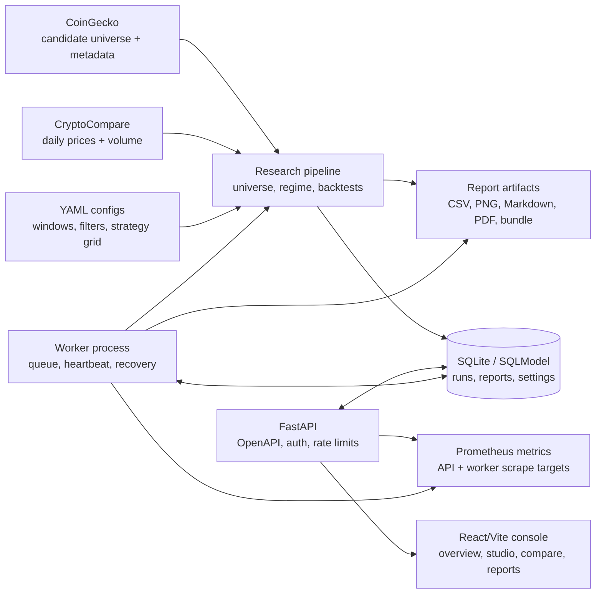

# Atlas20 Rotation

[](https://github.com/WW-shan/Atlas20/actions/workflows/ci.yml)
[](https://github.com/WW-shan/Atlas20/releases/latest)
[](LICENSE)
[](pyproject.toml)
[](apps/web/package.json)
[](src/atlas20/api/app.py)
[](apps/web)
[](docker-compose.yml)

Atlas20 Rotation is a production-minded crypto research console for testing
whether point-in-time top-20 non-stablecoin rotation can outperform BTC
buy-and-hold and top-20 equal weight benchmarks.

It is built like an operational research system, not a notebook dump: public
data ingestion, reproducible backtests, FastAPI services, a queued worker,
Prometheus metrics, OpenAPI contracts, Docker Compose deployment, GHCR images,
and a React/Vite console for reviewing results.

> Research only. Atlas20 does not provide financial advice and does not execute
> trades.

## Why It Stands Out

- **Point-in-time universe construction**: top-20 candidates are rebuilt at each
  rebalance date with explicit stablecoin, wrapped asset, liquidity, and data
  quality filters.
- **Reproducible research pipeline**: raw public data, processed datasets,
  strategy summaries, charts, manifests, and markdown/PDF/bundle reports are
  generated from versioned YAML configs.
- **Console-grade backend**: FastAPI routes, SQLModel repositories, Alembic
  migrations, idempotent run submission, request IDs, rate limits, auth hooks,
  structured logs, and Sentry-safe redaction.
- **Real worker lifecycle**: backtests are queued, claimed, heartbeated,
  cancelled, recovered after stale ownership, and monitored through Prometheus.
- **Contract-aware frontend**: React/Vite, TanStack Query, generated OpenAPI
  types, Vitest, axe accessibility tests, and Playwright smoke coverage.
- **Ship-ready operations**: Docker Compose stack, GHCR images, backup/storage
  CLIs, health probes, load testing script, and release verification command.

## Architecture



## What Is Included

- Momentum, sector, and benchmark strategy backtests.
- Bull-regime and BTC trailing-stop risk overlays.
- Point-in-time top-20 universe construction from cached public data.
- FastAPI read/write API for the Atlas20 Research Console.
- Background worker for queued backtests and report generation.
- React/Vite web console for champion review, constrained reruns, compare,
  history, universe health, and reports.
- Prometheus metrics, structured logging, security gates, backup/storage
  commands, and Docker deployment files.
- Python, API, frontend, accessibility, OpenAPI, mypy, Ruff, and build checks.

## Quickstart

### Docker Compose

Use this when you want the full API, worker, and web stack with the same shape
as the published GHCR images.

```bash
docker compose up -d
docker compose exec backend python -m atlas20.api.seed
```

Then open:

- API health: `http://127.0.0.1:8000/healthz`
- API readiness: `http://127.0.0.1:8000/readyz`
- Worker metrics: `http://127.0.0.1:8001/metrics`
- Web console: `http://127.0.0.1:5173`

### Local Development

Python:

```bash
python -m pip install -e ".[dev]"
python -m atlas20.api.seed
make dev
```

> Editable install (`-e`) is required for local development. A non-editable
> install can shadow the repo `src/` tree from `site-packages`.

Frontend:

```bash
npm --prefix apps/web ci
npm --prefix apps/web run dev
```

Worker:

```bash
PYTHONPATH=src python -m atlas20.api.worker
```

In development, Vite proxies `/api` to `http://127.0.0.1:8000`.

### Research Pipeline

```bash
python scripts/download_data.py --config config/base.yaml
python scripts/build_datasets.py --config config/base.yaml
python scripts/run_research.py --config config/base.yaml
```

Pass `--refresh-raw` to intentionally refresh public API data:

```bash
python scripts/run_research.py --config config/base.yaml --refresh-raw
```

## Quality Gates

Run the release verification command before publishing:

```bash
python scripts/verify_release.py
```

The CI matrix also runs these checks independently:

```bash
pytest -q
ruff check src tests
mypy --strict src/atlas20/api
python -m atlas20.api.openapi --check
npm --prefix apps/web test
npm --prefix apps/web run typecheck
npm --prefix apps/web run build
npm --prefix apps/web run openapi:check
pip-audit --strict .
npm --prefix apps/web audit --audit-level=moderate --registry=https://registry.npmjs.org
```

Current local verification for this release line covers 448 Python tests plus
181 Vitest tests, frontend build, strict API mypy, generated OpenAPI types, and
Ruff, plus Python and frontend dependency audits.

## Operations Surface

| Area | Implementation |
| --- | --- |
| API | FastAPI app factory, OpenAPI snapshot, request IDs, access logs, rate limits |
| Persistence | SQLModel tables, Alembic migrations, repository layer |
| Worker | Queue claim, heartbeat, cancellation, stale-run recovery, subprocess isolation |
| Metrics | Prometheus counters, histograms, worker liveness gauge, `/metrics` scrape targets |
| Reports | Markdown, CSV, PNG, PDF fallback, zip bundle, manifest verification |
| Deployment | Dockerfile, `apps/web/Dockerfile`, Docker Compose, GHCR image references |
| Security | API key/JWT hooks, prod settings gates, report path validation, log redaction |

See `docs/operations/` for backup, storage, logging, worker, security, and load
testing notes.

## Repository Layout

```text
.
|-- apps/web/                 # React/Vite research console
|-- config/                   # Research windows and sector mappings
|-- data/                     # Local cached raw/processed public data
|-- docs/                     # Design and operations documentation
|-- reports/                  # Included research output snapshots
|-- scripts/                  # Research, API, verification, and load-test commands
|-- src/atlas20/              # Python package: pipeline, API, worker, backtests
|-- tests/                    # Python test suite
|-- pyproject.toml
`-- README.md
```

## Core Design

- Market cap is used for universe selection only.
- Portfolio construction is not market-cap weighted.
- Strategies allocate by momentum, sector strength, and risk-regime logic.
- The universe is rebuilt point in time at every rebalance date.
- Data assumptions are explicit and documented in generated reports.

## Data Stack

- CoinGecko: candidate universe snapshots, market cap snapshot, metadata.
- CryptoCompare: long daily price and dollar-volume history.
- Historical market-cap proxy:
  `current_market_cap * historical_price / latest_historical_price`.

This keeps the project public-data friendly and reproducible. The trade-off is
that long-history market-cap ranks are approximations, not perfect historical
constituent data.

## Main Output Files

The end-to-end pipeline writes research artifacts to `reports/latest/`:

- `atlas20_report.md`
- `strategy_summary.csv`
- `turnover_summary.csv`
- `yearly_returns.csv`
- `regime_performance.csv`
- `daily_returns.csv`
- `equity_curves.csv`
- `drawdowns.csv`
- `equity_curves.png`
- `drawdowns.png`
- `rolling_12m_returns.png`
- `sector_exposure_<best_sector_strategy>.csv`
- `sector_exposure_<best_sector_strategy>.png`

Generated console reruns are written to `reports/app_runs/` and are ignored by
Git except for the directory placeholder.

## Current Included Snapshot

Using the cached public-data run included in this workspace:

- Best momentum variant: `TOP20_MOM_top8_biweekly__bull_only`
- Best sector variant: `TOP20_SECTOR_top3_biweekly__bull_only`
- BTC buy-and-hold CAGR: about 16.8%
- Top-20 equal-weight CAGR: about -5.0%
- Best momentum CAGR: about 8.1%
- Best sector CAGR: about -0.4%

See `reports/latest/atlas20_report.md` and the dated report folders for full
interpretation and caveats.

## Key Limitations

1. Long-history market caps are proxied because free public APIs do not reliably
   expose complete point-in-time daily market-cap history.
2. Candidate coverage reduces survivorship bias but is not perfectly
   survivorship-free.
3. Sector labels use human-editable mappings and manual overrides.
4. Included results depend on cached data snapshots and should be rerun before
   making new research claims.

## License

MIT. See `LICENSE`.
