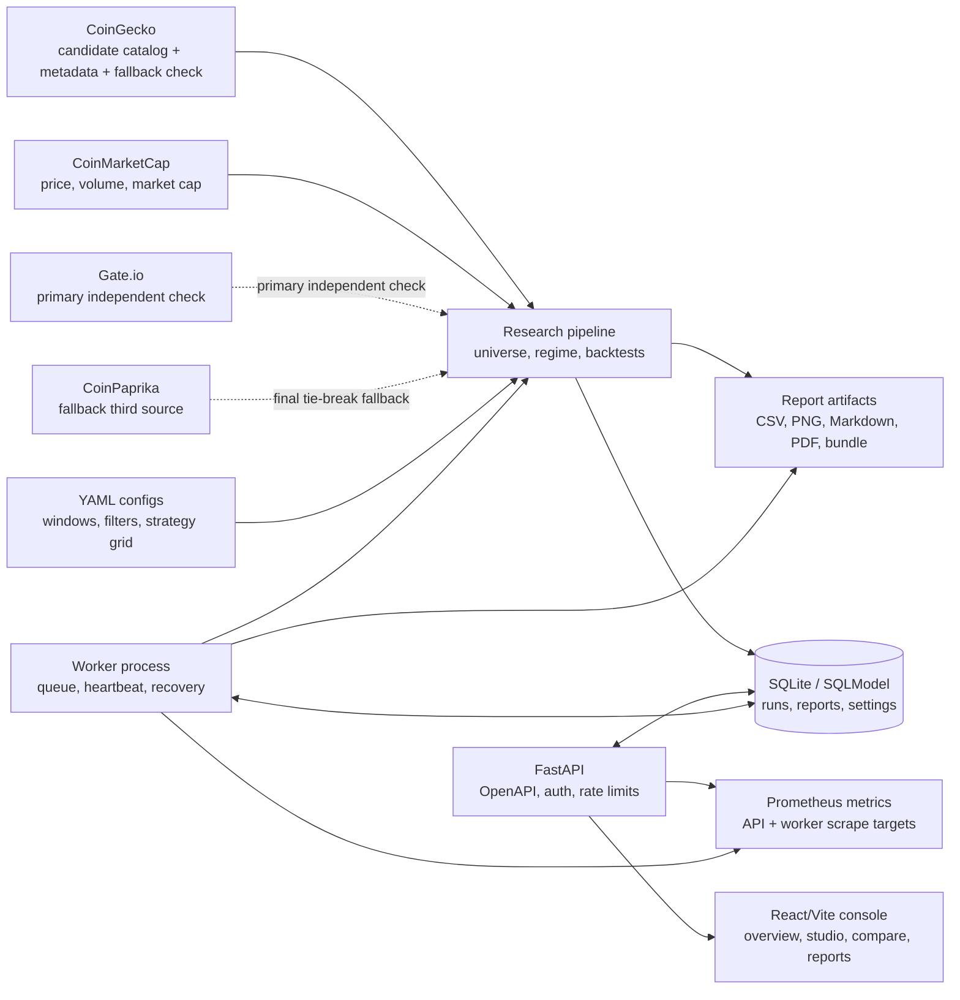

# Atlas20 Rotation

[](https://github.com/WW-shan/Atlas20/actions/workflows/ci.yml)
[](https://github.com/WW-shan/Atlas20/releases/latest)
[](LICENSE)
[](pyproject.toml)
[](apps/web/package.json)
[](src/atlas20/api/app.py)
[](apps/web)
[](docker-compose.yml)

Atlas20 Rotation is a production-minded crypto research console for testing
whether point-in-time top-20 non-stablecoin rotation can outperform BTC
buy-and-hold and top-20 equal weight benchmarks.

It is built like an operational research system, not a notebook dump: public
data ingestion, reproducible backtests, FastAPI services, a queued worker,
Prometheus metrics, OpenAPI contracts, Docker Compose deployment, GHCR images,
and a React/Vite console for reviewing results.

> Research only. Atlas20 does not provide financial advice and does not execute
> trades.

## Why It Stands Out

- **Point-in-time universe construction**: top-20 candidates are rebuilt at each
  rebalance date with explicit stablecoin, wrapped asset, liquidity, and data
  quality filters.
- **Reproducible research pipeline**: raw public data, processed datasets,
  strategy summaries, charts, manifests, and markdown/PDF/bundle reports are
  generated from versioned YAML configs.
- **Console-grade backend**: FastAPI routes, SQLModel repositories, Alembic
  migrations, idempotent run submission, request IDs, rate limits, auth hooks,
  structured logs, and Sentry-safe redaction.
- **Real worker lifecycle**: backtests are queued, claimed, heartbeated,
  cancelled, recovered after stale ownership, and monitored through Prometheus.
- **Contract-aware frontend**: React/Vite, TanStack Query, generated OpenAPI
  types, Vitest, axe accessibility tests, and Playwright smoke coverage.
- **Ship-ready operations**: Docker Compose stack, GHCR images, backup/storage
  CLIs, health probes, load testing script, and release verification command.

## Architecture



## What Is Included

- Momentum, sector, and benchmark strategy backtests.
- Bull-regime and BTC trailing-stop risk overlays.
- Point-in-time top-20 universe construction from cached public data.
- FastAPI read/write API for the Atlas20 Research Console.
- Background worker for queued backtests and report generation.
- React/Vite web console for champion review, constrained reruns, compare,
  history, universe health, and reports.
- Prometheus metrics, structured logging, security gates, backup/storage
  commands, and Docker deployment files.
- Python, API, frontend, accessibility, OpenAPI, mypy, Ruff, and build checks.

## Quickstart

### Docker Compose

Use this when you want the full API, worker, and web stack with the same shape
as the published GHCR images.

```bash
docker compose up -d
docker compose exec backend python -m atlas20.api.seed
```

Then open:

- API health: `http://127.0.0.1:8000/healthz`
- API readiness: `http://127.0.0.1:8000/readyz`
- Worker metrics: `http://127.0.0.1:8001/metrics`
- Web console: `http://127.0.0.1:5173`

### Local Development

Python:

```bash
make setup
.venv/bin/python -m atlas20.api.seed
make dev
```

`make setup` creates `.venv` and installs the package in editable mode with
development dependencies. Keep Python dependencies inside `.venv`; do not
install Atlas20 development dependencies into the system interpreter.

Frontend:

```bash
npm --prefix apps/web ci
npm --prefix apps/web run dev
```

Worker:

```bash
PYTHONPATH=src .venv/bin/python -m atlas20.api.worker
```

In development, Vite proxies `/api` to `http://127.0.0.1:8000`.

### Research Pipeline

```bash
.venv/bin/python scripts/download_data.py --config config/base.yaml
.venv/bin/python scripts/build_datasets.py --config config/base.yaml
.venv/bin/python scripts/run_research.py --config config/base.yaml
```

Pass `--refresh-raw` to intentionally refresh public API data:

```bash
.venv/bin/python scripts/run_research.py --config config/base.yaml --refresh-raw
```

## Quality Gates

Run the release verification command before publishing:

```bash
.venv/bin/python scripts/verify_release.py
```

The CI matrix also runs these checks independently:

```bash
make test
make lint
make typecheck
.venv/bin/python -m atlas20.api.openapi --check
npm --prefix apps/web test
npm --prefix apps/web run typecheck
npm --prefix apps/web run build
npm --prefix apps/web run openapi:check
.venv/bin/python -m pip_audit --strict .
npm --prefix apps/web audit --audit-level=moderate --registry=https://registry.npmjs.org
```

`make test` runs the Python suite through pytest inside `.venv`; `make lint`
and `make typecheck` run Ruff and mypy through the same virtual environment.

Current local verification for this release line covers 568 Python tests plus
188 Vitest tests, frontend build, strict API mypy, generated OpenAPI types, and
Ruff, plus Python and frontend dependency audits.

## Operations Surface

| Area | Implementation |
| --- | --- |
| API | FastAPI app factory, OpenAPI snapshot, request IDs, access logs, rate limits |
| Persistence | SQLModel tables, Alembic migrations, repository layer |
| Worker | Queue claim, heartbeat, cancellation, stale-run recovery, subprocess isolation |
| Metrics | Prometheus counters, histograms, worker liveness gauge, `/metrics` scrape targets |
| Reports | Markdown, CSV, PNG, PDF fallback, zip bundle, manifest verification |
| Deployment | Dockerfile, `apps/web/Dockerfile`, Docker Compose, GHCR image references |
| Security | API key/JWT hooks, prod settings gates, report path validation, log redaction |

See `docs/operations/` for backup, storage, logging, worker, security, and load
testing notes.

## Repository Layout

```text
.
|-- apps/web/                 # React/Vite research console
|-- config/                   # Research windows and sector mappings
|-- data/                     # Local cached raw/processed public data
|-- docs/                     # Design and operations documentation
|-- reports/                  # Included research output snapshots
|-- scripts/                  # Research, API, verification, and load-test commands
|-- src/atlas20/              # Python package: pipeline, API, worker, backtests
|-- tests/                    # Python test suite
|-- pyproject.toml
`-- README.md
```

## Core Design

- Market cap is used for universe selection only.
- Portfolio construction is not market-cap weighted.
- Strategies allocate by momentum, sector strength, and risk-regime logic.
- The universe is rebuilt point in time at every rebalance date.
- Data assumptions are explicit and documented in generated reports.

## Data Stack

- CoinMarketCap: the **only** historical provider. Every daily price, dollar
  volume, market cap and circulating supply in the panel comes from one
  snapshot.
- CoinGecko: candidate catalog (current top-N plus a legacy watchlist), coin
  metadata, and the fallback second-source check for assets Gate.io does not
  list. It never supplies panel prices.
- Gate.io: preferred second source for every listed asset. It has a generous
  public candle API, covers the delisted CEL and HT pairs, and never rewrites a
  panel value. A full refresh therefore does not depend on CoinGecko's small
  free-tier request budget.
- CoinPaprika: fallback third source when Gate.io or CoinGecko cannot provide
  the adjudicating vote. Its free historical endpoint covers the trailing 365
  days, which matches the configured cross-check window.

Universe ranks are built from the provider's own historical market cap, so
"was this coin top-20 on that date?" is answered with real supply data. There
is no synthetic fallback: with one provider the price/market-cap ratio is
always internally consistent, and an asset whose provider carries no supply
data is simply not rankable until its history begins. In the current snapshot
WhiteBIT Coin is excluded for exactly that reason instead of being ranked on a
guessed market cap.

## Main Output Files

The end-to-end pipeline writes research artifacts to `reports/latest/`:

- `atlas20_report.md`
- `strategy_summary.csv`
- `turnover_summary.csv`
- `yearly_returns.csv`
- `regime_performance.csv`
- `daily_returns.csv`
- `equity_curves.csv`
- `drawdowns.csv`
- `equity_curves.png`
- `drawdowns.png`
- `rolling_12m_returns.png`
- `sector_exposure_<best_sector_strategy>.csv`
- `sector_exposure_<best_sector_strategy>.png`

Generated console reruns are written to `reports/app_runs/` and are ignored by
Git except for the directory placeholder.

## Current Included Snapshot

Using the cached public-data run included in this workspace:

- Best momentum variant: `TOP20_MOM_top6_biweekly__always_on`
- Best sector variant: `TOP20_SECTOR_top3_monthly__bull_only`
- BTC buy-and-hold CAGR: about 19.4%
- Top-20 equal-weight CAGR: about 8.8%
- Best momentum CAGR: about 19.0%
- Best sector CAGR: about 15.8%

Read those honestly: the best rotation variant does not even match BTC
buy-and-hold, and it gets there with a worse drawdown (-87% for momentum,
-82% for the sector book, versus -77% for BTC). With the universe rebuilt from
real point-in-time CoinMarketCap market caps, **the diversified rotation
family has no edge over simply holding BTC.** The strategy lines that do beat
BTC decisively are the concentrated ones: the single-leader sector rotation
and the concentrated bull-offense family.

The BTC benchmark is anchored on the first day of the backtest window, so the
comparison is against a real buy-and-hold, not a benchmark that sat in cash
until the first month-end.

### Universe integrity

Two biases had to be removed before any of these numbers meant anything:

1. **Synthetic market caps.** The pipeline used to build a market cap from
   `price * latest_market_cap / latest_price` whenever the provider had no
   supply data. That ignores supply changes, so a coin could look like it grew
   through a bear market and take a Top-20 slot it never held. The fallback is
   gone; assets without real supply data are not rankable.
2. **Survivorship.** The candidate pool used to be "today's top-60", so every
   coin that was Top-20 in the past and has since collapsed was absent from the
   backtest - catastrophic for a momentum strategy, because the hottest coins
   are exactly the ones that blow up. Terra (LUNC) alone held 34 Top-20 slots
   and FTX (FTT) held 30. `universe.legacy_candidate_ids` now carries a
   historical watchlist, and the point-in-time ranking places those coins back
   where they belong: LUNC's last Top-20 appearance is 2022-05-06, days before
   the collapse; FTT's is 2022-11-04, days before FTX failed.

3. **Unverified provider prints.** CoinMarketCap is the only price source, so
   a corrupted block there is invisible from the inside - every Huobi Token row
   during a 34-day bad block still satisfied
   `market_cap == price * circulating_supply`. Recent history is therefore
   checked against Gate.io before an asset may enter the panel. CoinGecko
   remains the second source for assets Gate.io does not list. When the primary
   and second sources disagree, another independent provider supplies the
   adjudicating vote. The third source must pass the same full test, not merely
   have a similar median, before it can override the second source.

   The Celsius case is now confirmed: CMC quotes ~$19-44 while CoinGecko and
   Gate.io both quote ~$0.004-0.07, so CMC is the isolated outlier and CEL is
   refused. Huobi Token is also refused: CMC's recent series has a 31% median
   gap and a 3.4x latest gap versus CoinGecko, and Gate.io agrees with
   CoinGecko at a 2.0% median gap. Binance's public data mirror was tested but
   does not list either HTUSDT or CELUSDT, so it cannot cover these two cases.
   This is why the pipeline does not accept a median-only third-source
   confirmation.
   "Disagrees" and "could not be checked" remain separate states: a proven
   disagreement blocks the asset, while a missing second source is recorded as
   unverified so a CoinGecko outage degrades the run instead of emptying it
   (`data_quality.require_cross_check` upgrades that to a hard refusal).

`scripts/audit_data_chain.py` re-checks the whole chain - provider cache
integrity, panel sanity, price-level corruption, second- and third-source
agreement, feed continuity, point-in-time ranking and execution freshness - and
prints PASS/WARN/FAIL. Current state: 30 PASS, 3 WARN, 0 FAIL. Run it before
trusting any backtest.

See `reports/latest/atlas20_report.md` and the dated report folders for full
interpretation and caveats.

### Bull-offense research line

`scripts/run_bull_offense_scan.py` explores the concentrated, trend-filtered
family that actually answers the "beat BTC buy-and-hold" question, and writes
to `reports/bull_offense_scan/` (deliberately *outside* `reports/latest`, which
the pipeline replaces atomically on every run).

Latest run over the same window:

- 122 of 144 parameter combinations beat BTC buy-and-hold.
- The grid median is 18.4x total return (CAGR ~67.9%) versus BTC's 2.76x.
- The median maximum drawdown is -87%; the best cells exceed -91%.

The headline numbers survive the survivorship correction - the family's BTC
trend exit simply steps aside before the collapses (it was flat through both
the Terra and FTX failures). They are still not a forecast, and the yearly
breakdown in `bull_offense_yearly_returns.csv` is the honest way to read them:

| Year | Best cell | BTC |
| --- | --- | --- |
| 2021 | +8,560% | +57% |
| 2022 | -11% | -65% |
| 2023 | +305% | +155% |
| 2024 | +305% | +112% |
| 2025 | -40% | -7% |
| 2026 YTD | -43% | -9% |

**Unlevered spot is the version that matters.** Restricting the grid to the
`x1` cells - gross exposure never above 1, so no margin, no borrow, no funding
cost to model - **34 of 36 variants beat BTC**:

| | total | CAGR | Sharpe | max drawdown |
| --- | --- | --- | --- | --- |
| `BO_h3_lb21_ma50_x1` | 201x | 152.9% | 1.43 | -78.4% |
| `BO_h3_lb21_ma100_x1` | 146x | 139.3% | 1.38 | **-68.5%** |
| `BO_h2_lb30_ma100_x1` | 97x | 122.9% | 1.37 | **-61.1%** |
| grid median (x1 only) | 21.8x | - | - | -73.8% |
| BTC buy-and-hold | 2.76x | 19.4% | 0.60 | -76.7% |

The unlevered median drawdown is *smaller* than BTC's, and the best cells are
materially smaller, so this is not simply "more risk, more return". Note the
Sharpe column: the trend exit is doing the work, not the leverage.

One year (2021, the DOGE/SHIB melt-up) still dominates the compounded result,
and the strategy loses to BTC in the last two years. Treat it as a
high-variance satellite rather than a replacement for the benchmark.

## Key Limitations

1. Historical market caps come from CoinMarketCap. Assets that provider does
   not expose, or exposes without supply data, are excluded from the universe
   rather than estimated, so the earliest ranks are slightly less complete.
2. Candidate coverage reduces survivorship bias but is not perfectly
   survivorship-free.
3. Sector labels use human-editable mappings and manual overrides.
4. Included results depend on cached data snapshots and should be rerun before
   making new research claims.

## License

MIT. See `LICENSE`.
