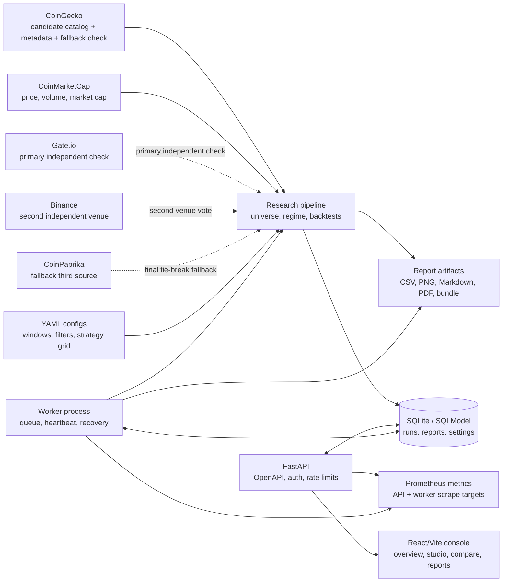

# Atlas20 Rotation

[](https://github.com/WW-shan/Atlas20/actions/workflows/ci.yml)
[](https://github.com/WW-shan/Atlas20/releases/latest)
[](LICENSE)
[](pyproject.toml)
[](apps/web/package.json)
[](src/atlas20/api/app.py)
[](apps/web)
[](docker-compose.yml)

Atlas20 Rotation is a production-minded crypto research console for testing
whether point-in-time top-20 non-stablecoin rotation can outperform BTC
buy-and-hold and top-20 equal weight benchmarks.

It is built like an operational research system, not a notebook dump: public
data ingestion, reproducible backtests, FastAPI services, a queued worker,
Prometheus metrics, OpenAPI contracts, Docker Compose deployment, GHCR images,
and a React/Vite console for reviewing results.

> Research only. Atlas20 does not provide financial advice and does not execute
> trades.

## Current Research Conclusion

The authoritative conclusion is in `RESEARCH.md` (sections 00 and 00.13, 2026-10-08). The current
frozen specification is **H5** (`PR2026-10-H5`): a strict point-in-time Top20, no-leverage
phase-staggered multi-horizon momentum ensemble, **blended 50/50 at the target level with a
Top20 breadth co-gate**, with **both books scaled by a cross-sectional dispersion overlay**.
Book A is the phase-staggered champion: four transparent trailing-return signals, three calendar
phases each, a Top2 hold band, a BTC 100D MA + confirm2 regime gate, and 60D volatility targeting.
Book B adds the risk-on condition `breadth(D) >= 0.50`, where breadth is the share of the day's
point-in-time Top20 above its own 50D SMA; when it fails, book B goes to cash. Every sleeve weight
is then multiplied by `min(1, 252D-P75(Top20 21D dispersion) / current dispersion)`, so the overlay
only de-risks and never levers up. The research sample is 2022-01-01 .. 2026-09-21; later data is
tracked as a genuine out-of-sample period for the frozen specification; the latest verified
tracking snapshot covers 2026-09-22 .. 2026-10-07.

| 2022-01-01 .. 2026-09-21 (H5) | 2bps (baseline) | 20bps | 50bps | 100bps | BTC |
| --- | ---: | ---: | ---: | ---: | ---: |
| Fill at the signal close | 26.51x | 21.47x | 15.10x | 8.39x | 1.87x |
| Fill 3h after the close (live timing, worse missing-candle case) | **24.12x** | 19.53x | 13.72x | 7.61x | |

H5 was adopted on 2026-10-08 over the H3 breadth co-gate on a like-for-like table
(`reports/phase_momentum_candidate_eval_h5/`). At the protocol fill (20bps, +3h, worse
missing-candle policy) it improves Sharpe 1.466 -> 1.623, max drawdown -37.7% -> -37.0%, one-year
rolling worst 0.733 -> 0.806 and best-year-removed 5.90x -> 6.51x, while average gross exposure
falls 29.9% -> 26.1%. Its pre-registered kill criterion passes at 2/20/50bps, and so do its
pre-declared 0.60/0.90 percentile neighbourhoods. It is the **first specification in this project
to pass the PBO gate: 0.192** over the extended 36-candidate family (H3 0.558 and B 0.526 both
fail). It does not raise the return ceiling - the overlay only de-risks - so the headline
20bps/+3h return (19.53x) is marginally below H3's and below 20x: the "pass below 20x is a recorded
risk variant" case written into the registration. At 2bps and at the live +1h fill H5 is above 20x
(24.12x / 22.80x).

The frozen specification has been tracked out of sample from 2026-09-22 through the latest
verified day, 2026-10-07 (16 daily observations). Unlike H3's breadth gate, the dispersion overlay
does fire in this window: with realistic +3h fills it returns 1.0576x at 20bps with a -6.39%
maximum drawdown, versus 1.0883x / -10.57% for H3 and 0.9616x for BTC. That is a positive start,
but 16 days are far too short to validate the strategy or clear the failed gates below. See
`reports/phase_momentum_oos_2026/`.

It is **provisional, not validated**. It clears 20x at the baseline 2bps cost even with realistic
fills, but one AGENTS.md gate still fails: the Deflated Sharpe against the project's real trial
count is **0.860** at the protocol fill (+3h, worse missing-candle policy; 6,135 Top20 trials since
2022). `scripts/analyze_dsr_gap.py` prices that gap: holding the return distribution's shape fixed,
the gate needs an annualized Sharpe of **1.846** against today's 1.623, i.e. **+13.7%**, not a
missing decimal.

`RESEARCH.md` section 00.14 asks where that 13.7% is lost, and returns a negative result that
closes a direction. The worst months are concentrated: 2023-04 lost **-19.3%** while BTC rose
**+2.8%**, with the BTC gate open all month and average gross exposure at 90% - and the dispersion
factor was **1.000 every day** (dispersion sat at 0.59 of its own 252-day 75th percentile, the state
the mechanism calls favourable for momentum). Comparing the nine months at or below -8% against the
other 44, none of the six observable state variables (BTC gate, breadth, dispersion ratio, market
volatility, the strategy's own trailing 63-day return, gross exposure) separates them by more than
**0.4 standard deviations**. H5's Sharpe gain comes from cutting volatility across the board, not
from dodging crashes, and another overlay from the same family is unlikely to close the gap - it
would only raise the trial count, and with it the required Sharpe. Closing it needs a genuinely new
information source, confirmed out of sample; the trial count is not re-cut, and the frozen
specification is tracked out of sample instead.

`RESEARCH.md` section 00.15 then screens the only untapped source inside the panel - volume,
turnover and market-cap concentration - against external mechanisms (Baker & Stein 2004 on
turnover as a sentiment indicator, Lee & Swaminathan 2000 on volume and momentum persistence,
Begušić & Kostanjčar 2019 on crypto momentum being concentrated in the most liquid coins,
Brauneis et al. 2021 on crypto liquidity measurement, and the 2025 open-access *Financial Markets and Portfolio Management* result that
volatility management mitigates large-cap crypto momentum crashes). Nine states were screened
against a bar fixed before the numbers were seen (|Spearman| >= 0.25 against next-month excess
return, monotone terciles, |crash - rest| >= 0.5σ). **All nine failed.** The closest direction -
market-cap concentration, where crash months are preceded by a *more diffuse* Top20 (HHI 0.412 vs
0.448, Welch t = -2.1) - misses the rank-information bar (rho = +0.166, p = 0.21), so it is
recorded as a rejected hypothesis rather than promoted to H6. The same screen corrects section
00.14: its table covered 53 of 57 months and had silently dropped 2022-04, a 10th crash month,
because `disp_ratio` needs 126 usable readings; recomputed state by state, the conclusion holds.
Read at the close *before* the month, the frozen spec is not defensive going into its worst months
(BTC gate open 0.90 vs 0.45, breadth 0.69 vs 0.37, gross 0.45 vs 0.23) - it is fully risk-on, and
those states are on through the bull market too, so they cannot be a de-risking filter without
giving up most of the return. No new trial was registered and the trial count is unchanged.

`RESEARCH.md` section 00.16 then screens the last information source already in the repository:
the Binance hourly candles, until now used only for the +1h/+3h fill protocol. 42 of the 43
point-in-time Top20 members traded over the window have hourly data (`bitget-token` does not) and
member-day coverage is 99.7%. Seven intraday states - 24-hour realized variance over its own
median, a Parkinson range ratio, the downside share of realized variance, the largest hour's share
of the day's dollar volume, Binance's share of reported member volume, the 30-day lag-one
autocorrelation of hourly returns, and the 00:00-08:00 UTC minus 08:00-24:00 UTC return - were
screened against the family-wise bar for eighteen candidates (|Spearman| >= 0.38 against
next-month excess return, monotone terciles, |crash - rest| >= 0.5σ). **All seven failed.** The
strongest, single-hour volume concentration (+0.262, monotone terciles), would have cleared the
first screen's unadjusted 0.25 bar but misses the 0.50σ separation test (-0.33), so it is recorded
as a rejected hypothesis; realized volatility, the textbook crash conditioner, ranks next-month
excess return at +0.036. Every information source the project holds - daily price, dollar volume
and market cap, plus hourly candles - has now been screened, and none of the states they can
express closes the Deflated-Sharpe gap. `RESEARCH.md` section 00.17 then goes outside the spot
panel to derivatives positioning: `scripts/download_funding_rates.py` caches the complete Binance
USDT-perpetual funding history from the public monthly archives (52 of 57 coins; `fapi.binance.com`
is unreachable here), and four funding states were screened against the family-wise bar for twenty
candidates (|Spearman| >= 0.38, monotone terciles, |crash - rest| >= 0.5σ). **All four were
rejected**, but `funding_level` is the best crash separator of everything tested: crash months start
with longs paying **3.19 bps a day** against **0.70** elsewhere (+1.12σ, Welch t = 1.99) and its
terciles are monotone. The direction is the finding: the same high-funding tercile carries the
*best* average months (H5 +12.7% against +3.1%), so de-risking on it would cut the best months, and
it is 0.61-0.66 correlated with the breadth, gate and gross exposure the spec already sees. Crowded
leverage is a volatility/regime amplifier, not a directional filter. Deployment note: funding
archives are monthly, not daily, so a funding state could be backtested here but not yet driven live.

The live target on 2026-10-07 is **100% NEAR** at **0.505 gross** (NEAR's 60-day realized volatility is
120% annualized, so the volatility target halves the book), entered from 2026-09-19 and solo since
2026-10-04. Single-coin days are normal for this design - 24 one-coin sleeves, 26.9% of invested days
historically - and the frozen spec is now at **22.68x at 20 bps** from 2022-01-01 to 2026-10-07
(2023 +215.8%, 2024 +90.2%, 2025 +102.1%, 2026 YTD +123.3% against BTC -6%). The two out-of-sample
weeks since 2026-09-22 returned **+5.61%** against BTC **-3.84%**; that window is far too short to
validate anything. `RESEARCH.md` section 00.18 also measures what happens after the book has chased
a coin: in the top quintile of trailing 21-day returns (>= +87%) the next 21 days return **+1.78%**
against **+7.74%** elsewhere (t = -4.99), or **+6.55%** against **+14.86%** per unit of gross
(t = -2.83) - the current NEAR entry sits in that bucket at +104%. The effect is a thinner edge, not
a loss, and it is recorded rather than traded: changing the entry rule would be a new pre-registered
trial, and the Deflated-Sharpe gate already fails on the trial count.
The pre-registered round (H2-H5 in `docs/research/literature_review_2026-09.md`) is logged
in `reports/research_trial_inventory/preregistered_trials.csv`. H4 was rejected; H2 and H3 remain
recorded risk variants and H5 was adopted as the frozen spec (see `RESEARCH.md` sections 00.6 and
00.13). A pre-declared entrant attribution check (`RESEARCH.md` section 00.7) shows the return comes
from long-standing Top20 incumbents, not from temporary new entrants (-8% to -9% of total
contribution at the live +3h fill), which answers the survivor-momentum critique of the crypto
momentum literature directly.

## Why It Stands Out

- **Point-in-time universe construction**: top-20 candidates are rebuilt at each
  rebalance date with explicit stablecoin, wrapped asset, liquidity, and data
  quality filters.
- **Reproducible research pipeline**: raw public data, processed datasets,
  strategy summaries, charts, manifests, and markdown/PDF/bundle reports are
  generated from versioned YAML configs.
- **Console-grade backend**: FastAPI routes, SQLModel repositories, Alembic
  migrations, idempotent run submission, request IDs, rate limits, auth hooks,
  structured logs, and Sentry-safe redaction.
- **Real worker lifecycle**: backtests are queued, claimed, heartbeated,
  cancelled, recovered after stale ownership, and monitored through Prometheus.
- **Contract-aware frontend**: React/Vite, TanStack Query, generated OpenAPI
  types, Vitest, axe accessibility tests, and Playwright smoke coverage.
- **Ship-ready operations**: Docker Compose stack, GHCR images, backup/storage
  CLIs, health probes, load testing script, and release verification command.

## Architecture


```mermaid
flowchart LR
    CG[CoinGecko<br/>candidate catalog + metadata + fallback check]
    CMC[CoinMarketCap<br/>price, volume, market cap]
    GATE[Gate.io<br/>primary independent check]
    BIN[Binance<br/>second independent venue]
    CP[CoinPaprika<br/>fallback third source]
    CFG[YAML configs<br/>windows, filters, strategy grid]
    PIPE[Research pipeline<br/>universe, regime, backtests]
    DB[(SQLite / SQLModel<br/>runs, reports, settings)]
    API[FastAPI<br/>OpenAPI, auth, rate limits]
    WORKER[Worker process<br/>queue, heartbeat, recovery]
    WEB[React/Vite console<br/>overview, studio, compare, reports]
    REPORTS[Report artifacts<br/>CSV, PNG, Markdown, PDF, bundle]
    METRICS[Prometheus metrics<br/>API + worker scrape targets]

    CG --> PIPE
    CMC --> PIPE
    GATE -. primary independent check .-> PIPE
    BIN -. second venue vote .-> PIPE
    CP -. final tie-break fallback .-> PIPE
    CFG --> PIPE
    PIPE --> REPORTS
    PIPE --> DB
    API <--> DB
    API --> WEB
    API --> METRICS
    WORKER <--> DB
    WORKER --> PIPE
    WORKER --> REPORTS
    WORKER --> METRICS
```

## What Is Included

- Momentum, sector, and benchmark strategy backtests.
- Bull-regime and BTC trailing-stop risk overlays.
- Point-in-time top-20 universe construction from cached public data.
- FastAPI read/write API for the Atlas20 Research Console.
- Background worker for queued backtests and report generation.
- React/Vite web console for champion review, constrained reruns, compare,
  history, universe health, and reports.
- Prometheus metrics, structured logging, security gates, backup/storage
  commands, and Docker deployment files.
- Python, API, frontend, accessibility, OpenAPI, mypy, Ruff, and build checks.

## Quickstart

### Docker Compose

Use this when you want the full API, worker, and web stack with the same shape
as the published GHCR images.

Compose requires an API key for mutating routes and report downloads and
refuses to start without one. Put it in a `.env` file next to
`docker-compose.yml` (git-ignored; `make dev` reads the same file) or export
it in your shell. Use 32+ random characters per key; separate several keys
with commas:

```bash
echo "ATLAS20_API_KEYS=$(openssl rand -hex 32)" >> .env
docker compose up -d
docker compose exec backend python -m atlas20.api.seed
```

Send the key as `X-API-Key` on mutating requests, e.g.
`curl -X POST -H "X-API-Key: <key>" http://127.0.0.1:8000/api/universe/refresh`.
The published web image does not send a key yet, so its run, refresh, report
and download actions return 401 under Compose; see
[`docs/operations/security.md`](docs/operations/security.md).

Every published port binds to `127.0.0.1` only. For remote access, put an
authenticating TLS reverse proxy in front instead of widening the bindings.

Then open:

- API health: `http://127.0.0.1:8000/healthz`
- API readiness: `http://127.0.0.1:8000/readyz`
- Worker metrics: `http://127.0.0.1:8001/metrics`
- Web console: `http://127.0.0.1:5173`

### Local Development

Python:

```bash
make setup
.venv/bin/python -m atlas20.api.seed
make dev
```

`make setup` creates `.venv` and installs the package in editable mode with
development dependencies. Keep Python dependencies inside `.venv`; do not
install Atlas20 development dependencies into the system interpreter.

Frontend:

```bash
npm --prefix apps/web ci
npm --prefix apps/web run dev
```

Worker:

```bash
PYTHONPATH=src .venv/bin/python -m atlas20.api.worker
```

In development, Vite proxies `/api` to `http://127.0.0.1:8000`.

### Research Pipeline

```bash
.venv/bin/python scripts/download_data.py --config config/base.yaml
.venv/bin/python scripts/build_datasets.py --config config/base.yaml
.venv/bin/python scripts/run_research.py --config config/base.yaml
```

Pass `--refresh-raw` to intentionally refresh public API data:

```bash
.venv/bin/python scripts/run_research.py --config config/base.yaml --refresh-raw
```

## Quality Gates

Run the release verification command before publishing:

```bash
.venv/bin/python scripts/verify_release.py
```

The CI matrix also runs these checks independently:

```bash
make test
make lint
make typecheck
.venv/bin/python -m atlas20.api.openapi --check
npm --prefix apps/web test
npm --prefix apps/web run typecheck
npm --prefix apps/web run build
npm --prefix apps/web run openapi:check
.venv/bin/python -m pip_audit --strict .
npm --prefix apps/web audit --audit-level=moderate --registry=https://registry.npmjs.org
```

`make test` runs the Python suite through pytest inside `.venv`; `make lint`
and `make typecheck` run Ruff and mypy through the same virtual environment.

Current local verification for this release line covers 568 Python tests plus
188 Vitest tests, frontend build, strict API mypy, generated OpenAPI types, and
Ruff, plus Python and frontend dependency audits.

## Operations Surface

| Area | Implementation |
| --- | --- |
| API | FastAPI app factory, OpenAPI snapshot, request IDs, access logs, rate limits |
| Persistence | SQLModel tables, Alembic migrations, repository layer |
| Worker | Queue claim, heartbeat, cancellation, stale-run recovery, subprocess isolation |
| Metrics | Prometheus counters, histograms, worker liveness gauge, `/metrics` scrape targets |
| Data freshness | Daily refresh heartbeat, `/api/data/freshness`, `/readyz` degradation, structured watchdog logs |
| Reports | Markdown, CSV, PNG, PDF fallback, zip bundle, manifest verification |
| Deployment | Dockerfile, `apps/web/Dockerfile`, Docker Compose, GHCR image references |
| Security | API key/JWT hooks, prod settings gates, report path validation, log redaction |

See `docs/operations/` for backup, storage, logging, worker, security, and load
testing notes. The strategy's go-live checklist, the Deflated-Sharpe horizon analysis and the
staged-capital plan are in [`docs/operations/go_live_plan.md`](docs/operations/go_live_plan.md).

## Repository Layout

```text
.
|-- apps/web/                 # React/Vite research console
|-- config/                   # Research windows and sector mappings
|-- data/                     # Local cached raw/processed public data
|-- docs/                     # Design and operations documentation
|-- reports/                  # Included research output snapshots
|-- scripts/                  # Research, API, verification, and load-test commands
|-- src/atlas20/              # Python package: pipeline, API, worker, backtests
|-- tests/                    # Python test suite
|-- pyproject.toml
`-- README.md
```

## Core Design

- Market cap is used for universe selection only.
- Portfolio construction is not market-cap weighted.
- Strategies allocate by momentum, sector strength, and risk-regime logic.
- The universe is rebuilt point in time at every rebalance date.
- Data assumptions are explicit and documented in generated reports.

## Data Stack

- CoinMarketCap: the **only** historical provider. Every daily price, dollar
  volume, market cap and circulating supply in the panel comes from one
  snapshot.
- CoinGecko: candidate catalog (current top-N plus a legacy watchlist), coin
  metadata, and the fallback second-source check for assets Gate.io does not
  list. It never supplies panel prices.
- Gate.io: preferred second source for every listed asset. It has a generous
  public candle API, covers the delisted CEL and HT pairs, and never rewrites a
  panel value. A full refresh therefore does not depend on CoinGecko's small
  free-tier request budget.
- Binance: second exchange venue, reached through its official public data
  mirror `data-api.binance.vision`. `api.binance.com` answers HTTP 451 from
  this host, and `api.binance.us` is a different, much thinner book - 51 of the
  73 panel pairs it quoted traded under $10k/day and 27 under $1k, so its
  "close" was often a stale print (it reported ENJ 14% away from CMC purely
  from illiquidity). The mirror is the same venue and the same order book with
  no key and no geo-block: 79 of 101 panel pairs, every one of them above
  $100k/day. Days below `providers.binance.min_daily_dollar_volume` are dropped
  rather than counted, so a thin day reads as "this venue cannot certify
  today" instead of as a disagreement with CMC. Like every other validator it
  only votes; CMC still owns every panel value.
- CoinPaprika: fallback third source when Gate.io or CoinGecko cannot provide
  the adjudicating vote. Its free historical endpoint covers the trailing 365
  days, which matches the configured cross-check window.

The Docker Compose deployment enables `ATLAS20_DAILY_REFRESH_ENABLED` by
default; a standalone API run can set it explicitly. The scheduler queues one
refresh at the configured UTC time and writes an atomic heartbeat to
`data/data_freshness.json`. The heartbeat records the latest date from CMC and
each independent source, whether the refresh completed, and whether the
primary date advanced. `GET /api/data/freshness` exposes that state; `/readyz`
returns 503 for `stale`, `missing`, `failed`, or `stalled`. A watchdog logs the
same state every 30 minutes with the `data_freshness` structured field, so
stopped or non-advancing feeds are visible in API logs even before the next
backtest.

CMC finalises day D's close somewhere after 00:00 UTC on D+1 and is sometimes
still publishing when the job fires, so a second conditional attempt runs
`ATLAS20_DAILY_REFRESH_CATCHUP_OFFSET_HOURS` later (default 4).

That scheduler lives **inside the API process**, so nothing refreshes while the
API is stopped - which is the normal state on this workstation. For a machine
that is not running the API around the clock, `ops/com.atlas20.daily-refresh.plist`
is an equivalent launchd job that runs `scripts/download_data.py` followed by
`scripts/build_datasets.py` at 02:30 and 06:30 UTC and appends to
`~/Library/Logs/atlas20-daily-refresh.log`. It is installed on this machine;
verify it with:

```bash
launchctl print gui/$(id -u)/com.atlas20.daily-refresh | head
launchctl list | grep atlas20        # confirms it is registered
```

For another machine, install the checked-in plist with `cp` plus
`launchctl bootstrap gui/$(id -u) ~/Library/LaunchAgents/com.atlas20.daily-refresh.plist`.
launchd reads the plist's `StartCalendarInterval` in the machine's **local**
time zone, not UTC. The checked-in hours (10 and 14) are 02:30/06:30 UTC for
this workstation's Asia/Shanghai zone; convert them for any other zone, or the
job fires before CoinMarketCap has published the close.

`ops/com.atlas20.cmc-probe.plist` is a second launchd job (installed here as
well) that measures when CoinMarketCap finishes publishing day D-1, so the fill
can move from +3h to +1h. It runs every 15 minutes through the 00:05-03:50 UTC
window and appends to `reports/provider_publication/cmc_publication_probe.csv`
(a local, untracked operational log; `reports/provider_publication/*` is
gitignored so the job never dirties the working tree);
see `docs/operations/execution_latency.md` for the decision rule.

Verify the result by checking the panel's last date, which is the number that
actually matters for a backtest:

```bash
tail -3 data/processed/panel_daily.csv | cut -d, -f1
```

A one-off refresh by hand is the same two commands the job runs:

```bash
.venv/bin/python scripts/download_data.py --config config/base.yaml
.venv/bin/python scripts/build_datasets.py --config config/base.yaml
```

It queues a refresh only while the last completed day is still missing, so a normal day
costs nothing and a late publication is picked up within hours instead of the
next morning. The readiness gate treats a panel that is a full day old as
`stale`: yesterday's close is the baseline, so `MAX_PRIMARY_LAG_DAYS=1` allows
exactly that and nothing worse.

Universe ranks are built from the provider's own historical market cap, so
"was this coin top-20 on that date?" is answered with real supply data. There
is no synthetic fallback: with one provider the price/market-cap ratio is
always internally consistent, and an asset whose provider carries no supply
data is simply not rankable until its history begins. In the current snapshot
WhiteBIT Coin is excluded for exactly that reason instead of being ranked on a
guessed market cap.

## Main Output Files

The end-to-end pipeline writes research artifacts to `reports/latest/`:

- `atlas20_report.md`
- `strategy_summary.csv`
- `turnover_summary.csv`
- `yearly_returns.csv`
- `regime_performance.csv`
- `daily_returns.csv`
- `equity_curves.csv`
- `drawdowns.csv`
- `equity_curves.png`
- `drawdowns.png`
- `rolling_12m_returns.png`
- `sector_exposure_<best_sector_strategy>.csv`
- `sector_exposure_<best_sector_strategy>.png`

Generated console reruns are written to `reports/app_runs/` and are ignored by
Git except for the directory placeholder.

## Current Included Snapshot

Using the cached public-data run included in this workspace:

- Best momentum variant: `TOP20_MOM_top6_biweekly__always_on` - +323.8% total,
  CAGR about 28.7%, Sharpe 0.72, max drawdown -74.6%
- Best sector variant: `TOP20_SECTOR_top4_monthly__bull_only` - CAGR about 16.0%
- BTC buy-and-hold CAGR: about 20.8% (+194.2% total)
- Top-20 equal-weight CAGR: about 11.2%
- Best sector CAGR: about 16.0%

Read those honestly. The momentum book beats BTC buy-and-hold on return, Sharpe
and drawdown (-74.6% versus -76.6%), but almost all of the outperformance is
the 2021 leg (+445% versus BTC's +57%); it loses to BTC in 2022, 2023, 2024 and
2025. The current concentrated champion is documented in `RESEARCH.md`; the
standalone snapshots in `reports/latest/` remain useful as broad benchmark
comparisons, not as the final strategy verdict.

**The benchmark moved on 2026-09-22 and that is an engine fix, not a strategy
change.** `BTC_BH`/`ETH_BH` were still subject to the 50% sector cap, so the
"buy-and-hold" benchmark was silently half invested in cash; the pipeline now
lifts both the per-coin and per-sector cap for benchmarks (`max_weight_per_coin`
and `max_weight_per_sector` = 1.0), which is what a real buy-and-hold is. Every
number in this section is generated from `reports/latest/` by the pipeline and
pinned by `tests/test_checked_in_report_snapshot.py`.

The BTC benchmark is anchored on the first day of the backtest window, so the
comparison is against a real buy-and-hold, not a benchmark that sat in cash
until the first month-end.

### Universe integrity

Two biases had to be removed before any of these numbers meant anything:

1. **Synthetic market caps.** The pipeline used to build a market cap from
   `price * latest_market_cap / latest_price` whenever the provider had no
   supply data. That ignores supply changes, so a coin could look like it grew
   through a bear market and take a Top-20 slot it never held. The fallback is
   gone; assets without real supply data are not rankable.
2. **Survivorship.** The candidate pool used to be "today's top-60", so every
   coin that was Top-20 in the past and has since collapsed was absent from the
   backtest - catastrophic for a momentum strategy, because the hottest coins
   are exactly the ones that blow up. Terra (LUNC) alone held 34 Top-20 slots
   and FTX (FTT) held 30. `universe.legacy_candidate_ids` now carries a
   historical watchlist, and the point-in-time ranking places those coins back
   where they belong: LUNC's last Top-20 appearance is 2022-05-06, days before
   the collapse; FTT's is 2022-11-04, days before FTX failed.

   The watchlist alone was not enough. A coin whose ticker left
   CoinMarketCap's symbol map (a rebrand or a token migration) resolved to "no
   provider id" and dropped out of the pool, and the audit could not see it
   because it only compared against coins that had already been fetched. Two
   guards close that hole: `universe.cmc_symbol_aliases` maps the retired
   tickers that still have history (EOS, MKR, HT, CEL, MATIC, FTM), and the
   audit now fails if any watchlist coin is neither onboarded nor explicitly
   recorded in `universe.legacy_unavailable` with a reason. MATIC was recovered
   this way; Fantom was checked and never ranked better than 21st on a
   rebalance date, so it displaced nobody; Bitcoin SV is recorded as
   un-onboardable (CoinGecko deleted it, and the panel is keyed on its id) and
   costs 7 rebalance dates.

3. **Unverified provider prints.** CoinMarketCap is the only price source, so
   a corrupted block there is invisible from the inside - every Huobi Token row
   during a 34-day bad block still satisfied
   `market_cap == price * circulating_supply`. Recent history is therefore
   checked against Gate.io before an asset may enter the panel. CoinGecko
   remains the second source for assets Gate.io does not list. When the primary
   and second sources disagree, another independent provider supplies the
   adjudicating vote. The third source must pass the same full test, not merely
   have a similar median, before it can override the second source.

   The independent source must also **cover CoinMarketCap's latest date**. A
   provider that stopped days earlier cannot certify today's print, so a stale
   overlap is refused rather than treated as agreement. Unverified assets are
   refused by default (`data_quality.require_cross_check: true`); the audit
   records the latest primary/secondary dates and the staleness gap.

   CoinGecko market-chart caches are refreshed after three hours. This matters
   for assets Gate.io does not list: a two-day-old fallback chart would fail
   the latest-date check and wrongly remove the asset's entire history from the
   panel, even though its CMC history was sound.

   A series that has **ended** is the one exception, because there is no
   current print to protect: a delisted or migrated asset is verified over the
   overlap its venue still has, and the audit prints how many trailing days
   rest on CoinMarketCap alone. Venue requests follow the asset's own window
   rather than "the last 400 days from today", which is what lets a pair the
   venue stopped quoting months ago be checked at all.

   The Celsius case is now confirmed: CMC quotes ~$19-44 while CoinGecko and
   Gate.io both quote ~$0.004-0.07, so CMC is the isolated outlier and CEL is
   refused. Huobi Token is also refused: CMC's recent series sits 23.6% away
   (median) and 3.1x away (latest) from Gate.io, while CoinGecko independently
   agrees with Gate.io to within 0.003% on the latest print - the two venues
   are not related to each other, so CMC is the outlier. Binance does not list
   either HTUSDT or CELUSDT, so those two cases still resolve through
   CoinGecko, which is exactly why the pipeline does not accept a median-only
   third-source confirmation.

   "Disagrees" and "could not be checked" remain separate states: a proven
   disagreement blocks the asset, while a missing second source is recorded as
   unverified; with the new default it is refused rather than silently
   admitted.

4. **Missing returns are not silently flat.** A provider gap inside a live
   series leaves the gap days without a return, and the first print after the
   gap is measured from the last one. A coin whose market cap is only carried
   that day is not ranked that day. The production policy
   (`frictions.missing_return_policy: carry`) keeps a held coin at its last
   close through such a gap for at most `missing_return_max_carry_days` (3) and
   lists every carried holding and every trade priced at a carried close in
   the backtest's `gap_carries` (written to `gap_carries.csv`); a longer gap
   aborts the run. A feed that has ended (delisting, migration) is sold at its
   last print. `error` refuses any held gap; `fill` is only for a labelled
   sensitivity run and defaults to a -100% write-down.

`scripts/audit_data_chain.py` re-checks the whole chain - provider cache
integrity, panel sanity, price-level corruption, latest-date independent-source
coverage, terminal missing-return handling, feed continuity, point-in-time
ranking, real point-in-time Top-N membership and execution freshness - and
prints PASS/WARN/FAIL. Current state: 43 PASS, 6 WARN, 0 FAIL. The warnings are

* 37 CMC rows where reported market cap differs from `price * supply` by more
  than 1% (rankings still use CMC's reported market cap directly);
* the uncharged funding cost on leveraged exposure;
* the point-in-time Top-N members the panel cannot carry, measured on the
  strategy's real rebalance dates rather than on calendar days: USTC is missing
  on 15 of them (excluded as a stablecoin by name) and BSV on 7 (delisted from
  CoinGecko, which the panel is keyed on), so the next-ranked coin is promoted
  in their place;
* two ended feeds, MATIC (to 2025-03-24) and FTM (to 2025-01-13). Their series
  stop because the tokens migrated; the engine liquidates a holding at the last
  print instead of carrying it flat, and the audit records how many trailing
  days rest on CoinMarketCap alone (MATIC 195 days, FTM 0). Both are verified
  against Binance over their own length - 1,953 overlapping days for MATIC and
  2,006 for FTM - because a delisted series has no current print for a venue to
  confirm;
* three short interior provider gaps (LINK 1 day, CRV 4 days, KCS 1 day, all
  around 2022-07-31), which the panel carries at the last observed price.

Run it before trusting any backtest. Research scripts build their custom-window
panels in memory (`persist=False`) and never overwrite the canonical processed
panel; the daily refresh refuses to shrink the asset set or move the panel
start/end backwards.

See `reports/latest/atlas20_report.md` and the dated report folders for full
interpretation and caveats.

### Strategy research: read `RESEARCH.md` first

**`RESEARCH.md` is the single authoritative record of the strategy research.**
It supersedes every earlier narrative in this README, in `reports/`, and in any
scratch result. If this section disagrees with it, `RESEARCH.md` wins.

The previous fixed-21-day CTREND-breakout candidate and the earlier 5x-6x
volatility-target ensemble are historical research branches, not the current
champion. The current frozen specification is **H5** (`PR2026-10-H5`, adopted
2026-10-08): a 50/50 target-level blend of the **phase-staggered multi-horizon
momentum ensemble** (book A) with the same ensemble plus a **Top20 breadth
co-gate** (book B), with **both books scaled by a cross-sectional dispersion
overlay**, inside the strict point-in-time Top20:

> Top20 → four transparent trailing-return signals (7/14/21/28/42/60D,
> 21D, 7/14/28/60D equal weight, and 14/21/28D equal weight) → three
> calendar phases per signal → hold while the incumbent remains in the
> sleeve's Top2 → BTC 100D MA + confirm2 → 60D volatility target at 80%
> with gross exposure capped at 1.0 → T+1 execution.
>
> Book B adds: `breadth(D) >= 0.50`, where breadth is the share of the day's
> point-in-time Top20 above its own 50D SMA; when it fails, book B goes to
> cash. The two books are mixed 50/50 at the target level and rebalanced
> there by the production engine.
>
> Both books then multiply every sleeve weight by the dispersion factor
> `min(1, 252D-P75(Top20 21D return dispersion) / current dispersion)`, so the
> overlay only de-risks (a missing reading leaves the factor at 1).

| 2022-01-01 .. 2026-09-21 (H5) | 2bps | 20bps | 50bps | 100bps | BTC |
| --- | ---: | ---: | ---: | ---: | ---: |
| Total return | **26.51x** | **21.47x** | 15.10x | 8.39x | 1.87x |
| Sharpe | 1.784 | 1.684 | 1.516 | 1.235 | 0.515 |
| Max drawdown | -35.5% | -37.7% | -41.3% | -46.8% | -66.9% |

The validation below is the 2026-09-25 audit of the pre-switch single-book
champion B; H5's own gate status (DSR 0.860, PBO **0.192 - the first pass in
this project**, neighbourhood 0.60/0.90 both keep the kill criterion) is in
`RESEARCH.md` section 00.13, and H3's superseded status in section 00.11. B's
audit record:

- Execution timing: filling 1/3/6/12 hours after the close gives
  21.22x/19.56x/20.78x/21.57x at 20bps; filling at the next close gives
  12.01x. Hourly candles come from Binance and, for coins Binance does not
  list, Gate.io (`scripts/download_hourly_prices.py --venue gate`).
- Multiple testing: Deflated Sharpe **0.731** against the 6,135 Top20 trials
  since 2022 (fail; the old 0.9945 counted only 32 candidates). White Reality
  Check within the 30-variant family: p=0.019 against zero, p=0.025 against
  BTC. PBO **0.526** (fail), so no best-parameter selection is used. The eight
  pre-registered H2/H3/H5 neighbourhood trials are counted in this denominator.
- Parameter neighbourhood: narrow peaks at the BTC MA100 gate and the Top2
  hold band (see above) - a robustness failure under AGENTS.md.
- 365D/90D walk-forward from 2023 over the 25 pre-specified variants,
  including 40bps switch cost: **20.78x** (fills at the close).
- Best-year removal: removing 2023 leaves **4.83x** versus BTC **0.73x**.
- Leave-one-signal / leave-one-phase: **20.58x-27.58x** / **21.26x-23.91x**.
- 2020-10-03 .. 2021-12-31 stress at 20bps: **4.55x**, Sharpe 2.39,
  maximum drawdown -18.9%.
- Market regimes with look-ahead-free (previous-day) labels: bull **25.37x**
  versus BTC 3.27x; non-bull **0.91x** versus BTC 0.57x.
- Point-in-time selection audit: 10,308 selections, 3,436 hold-rule checks
  and 990 traded targets, zero violations.

The latest target snapshot is generated by:

```bash
.venv/bin/python scripts/run_phase_momentum_live_signal.py
```

It builds the frozen spec (H5, `PR2026-10-H5`) by default and evaluates up to
the latest completed UTC day, writing `reports/phase_momentum_live/latest_signal.json`
and `.md`; it does not place orders. Pass `--trial-id champion-defaults` for the
pre-switch single-book champion, or `--trial-id PR2026-10-H3` for the superseded
breadth co-gate blend. It refuses a panel more than `--max-staleness-days`
(default 1) behind the latest completed UTC day (`--allow-stale` for deliberate
backfills) and a last day whose volumes look unfinished (`--allow-partial-day` to
override; the check is recorded in `last_day_check`). The payload records the
`trial_id`, says whether a trade is required on the as-of date (`trade_required`),
shows both the target and the engine's current drifted book (`current_weights`),
and lists the sleeve snapshot with a `book` column (0 = book A, 1 = book B).

A daily Telegram push can be enabled after the snapshot is generated:

```bash
.venv/bin/python scripts/send_telegram_signal.py --dry-run
.venv/bin/python scripts/send_telegram_signal.py --force
```

It reports today's buy/sell instructions in USDT, the post-trade target
holdings, and the percentage-point change. The amounts default to a 1000 USDT
model capital and can be changed with
`ATLAS20_TELEGRAM_CAPITAL` or `--capital`. It is notification-only and never
places an order. Credentials are read from `ATLAS20_TELEGRAM_BOT_TOKEN` and
`ATLAS20_TELEGRAM_CHAT_ID`; multiple comma-separated chat ids are supported.
See `docs/operations/telegram_signal.md`. Ubuntu
deployments use the checked-in `ops/systemd/atlas20-telegram-signal.{service,timer}`
units, with no macOS launchd dependency.

Reproduce the current frozen spec with the commands in `RESEARCH.md` section
0.3 (dependency order) and `RESEARCH.md` section 00.13.

Legacy volatility-target and daily-event reports remain in `reports/` for
audit history, but they are not the current champion.

The older bull-offense numbers (51.3x on 2021, 2.93x on 2022) are superseded.
The 2021-inclusive result must not be used to choose live sizing.

## Key Limitations

1. Historical market caps come from CoinMarketCap. Assets that provider does
   not expose, or exposes without supply data, are excluded from the universe
   rather than estimated, so the earliest ranks are slightly less complete.
2. Candidate coverage reduces survivorship bias but is not perfectly
   survivorship-free.
3. Sector labels use human-editable mappings and manual overrides.
4. Included results depend on cached data snapshots and should be rerun before
   making new research claims.

## License

MIT. See `LICENSE`.
